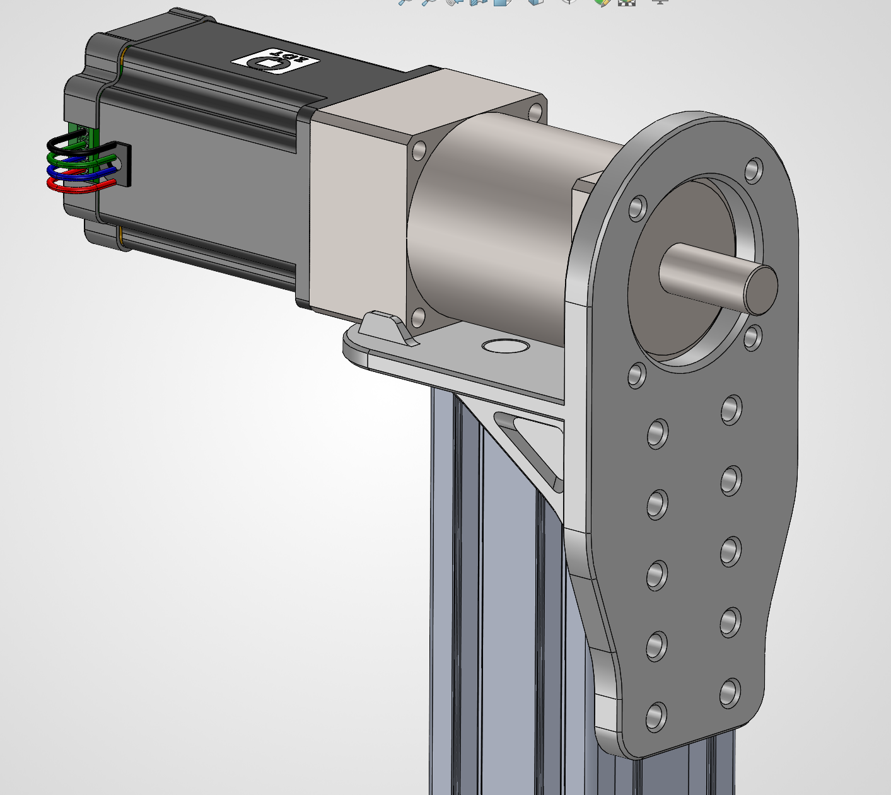
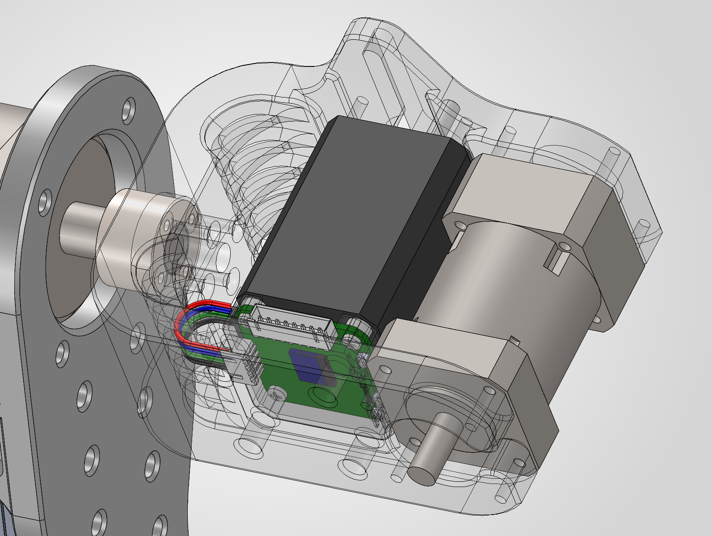
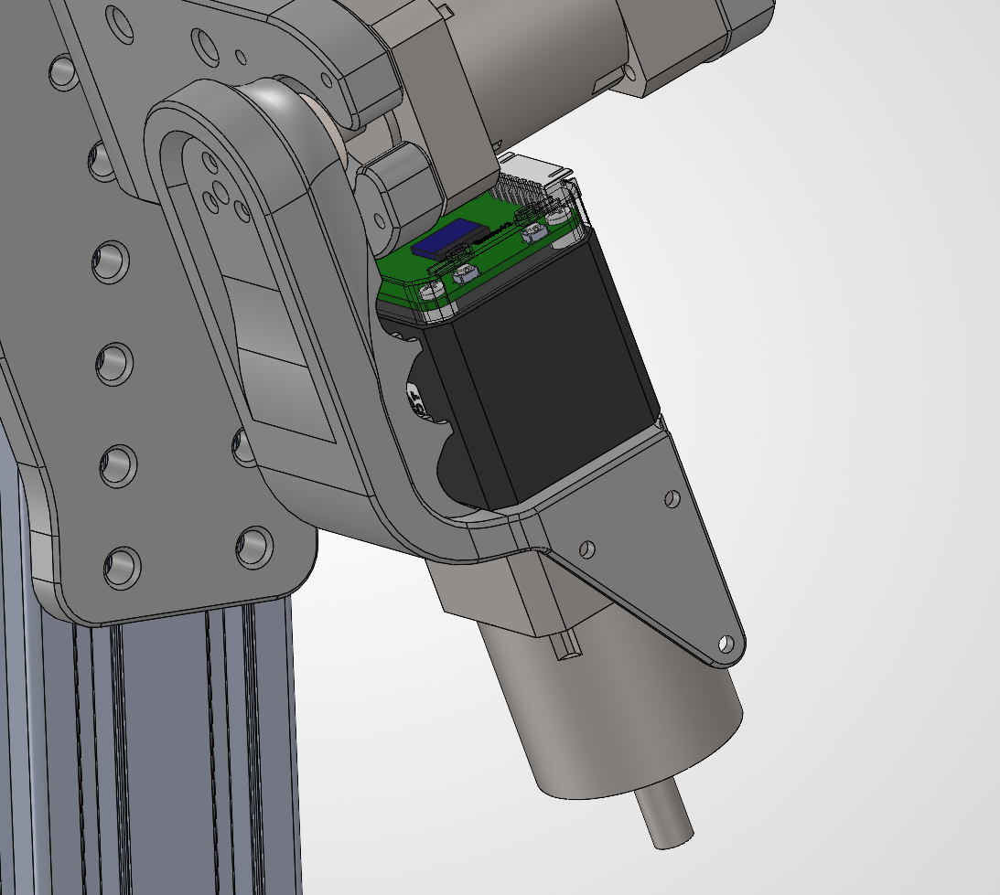
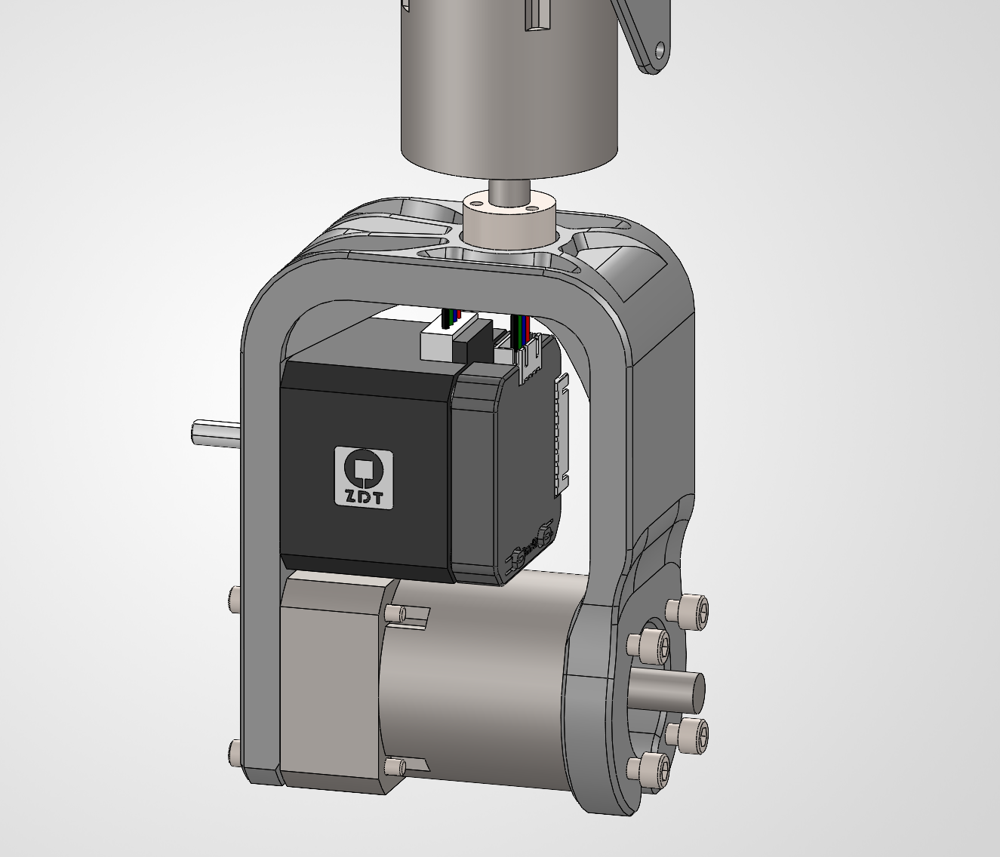
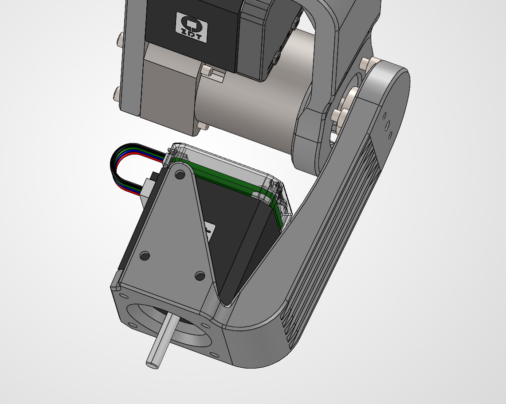
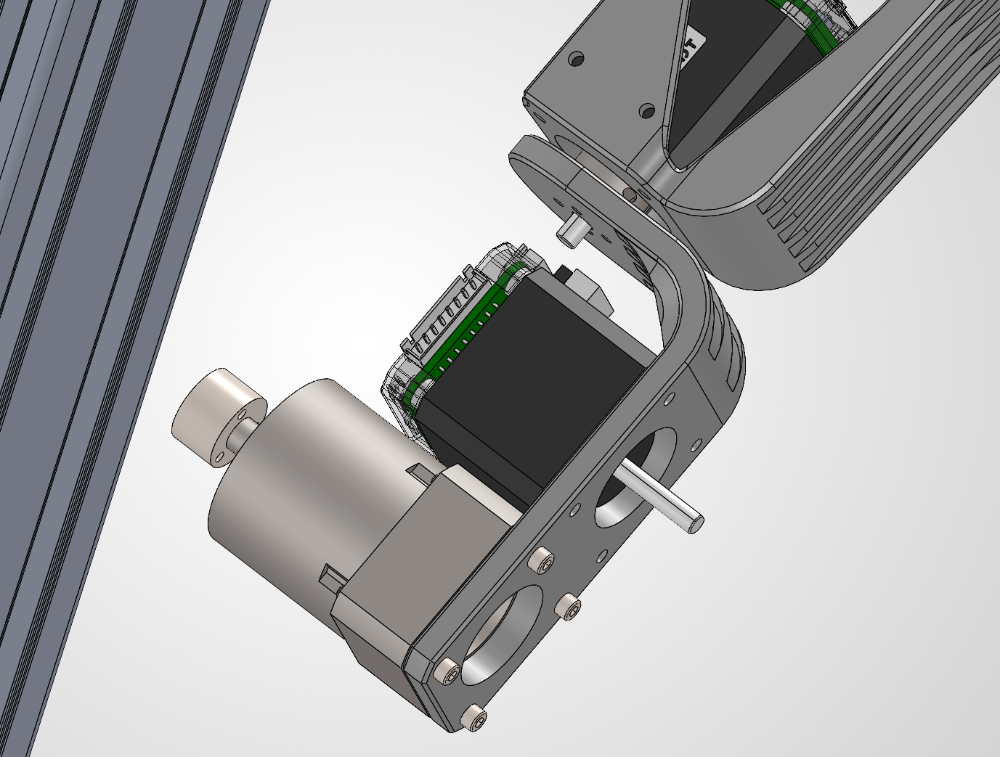

# Assembly Guide - ArmSync 7DOF Robotic Arm

## Preparation

### Tool List
- Hex key set / Screwdriver set

### Parts Check
Before assembly, verify all parts against [Parts BOM](./Parts%20BOM.md).

---

## Assembly Steps

### Step 1: J1 Base Rotation Joint

**Parts Required:**
- J1 Base printed part × 1
- 6060 Aluminum Extrusion 650mm × 1
- 57×76mm Stepper Motor × 1
- PRF57-L2-20-P2 Gearbox × 1
- Locking Bushing Z21 14×26×17 × 1
- M6×16 Screws × 10
- M6 T-Nuts × 12
- M5×25 Screws × 8
- M3×31 Screws × 4 (for locking bushing)

**Assembly Procedure:**

1. **Install Aluminum Extrusion Base**
   - Connect the 6060 aluminum extrusion with J1 Base
   - Secure with M6 T-nuts + M6×16 screws
   - Ensure extrusion is perpendicular to base, tighten screws evenly. You can insert 4 3D-printed pins at the top to assist alignment.

2. **Install Gearbox**
   - Align gearbox output flange with the structural ring, secure gearbox to base with M5 screws

3. **Install Motor**
   - Insert 57 stepper motor shaft into gearbox input shaft, tighten the fastening screw on gearbox input end
   - Check if motor shaft and gearbox shaft rotate synchronously



---

### Step 2: J2 Shoulder Pitch Joint

**Parts Required:**
- Shoulder printed part × 1
- 42×60mm Stepper Motor × 1
- PRF42-L2-30-P2 Gearbox × 1
- Locking Bushing Z21 8×18×11 × 1
- Diaphragm Coupling D32d8 L28 × 1 **Note: The coupling needs to be disassembled into two halves. Use one half's shaft bore and its end flange to connect the structural part and shaft.**
- M2.5×24 Screws × 3 (locking bushing)
- M3×20+ Screws × 8
- M3×75+ Screws × 4

**Assembly Procedure:**

1. **Connect J1 and J2**
   - Align Shoulder part with J1 Base gearbox output shaft
   - Connect using locking bushing. The 4 M3 holes need to be tightened very firmly to ensure secure fastening
   - **Note: This is the load-bearing joint of the entire arm, tighten securely**

2. **Install Gearbox to Shoulder**
   - As shown below, embed PRF42-L2-30-P2 gearbox into the outer position of the structural part, secure with 8 M3 screws

3. **Install Motor**
   - Remove motor driver board plastic protective cover
   - Slide 42×60mm motor into the inner motor position of Shoulder
   - Use screwdriver through the 4 pre-drilled holes to remove original motor M3 screws, replace with 75mm long screws to fasten motor to structural part



---

### Step 3: J3 Shoulder Yaw Joint

**Parts Required:**
- Upperarm up printed part
- 42×40mm Stepper Motor × 1
- PRF42-L1-10-P2 Gearbox (round flange) × 1
- Locking Bushing Z21 8×18×11 × 1 (or coupling option, use one half of L32d8 coupling)
- M2.5×16 Screws × 3 (locking bushing)
- M3×59+ Screws × 4

**Assembly Procedure:**

1. **Align Motor Mounting Holes**
   - Align 42×40mm motor to Upperarm up motor position
   - Remove original screws, replace with M3×59+ screws to pre-fasten motor to structural part

2. **Install Gearbox and Motor**
   - Place PRF42-L1-10-P2 gearbox (round flange up), align to lower end of Upperarm up
   - Tighten M3×59+ screws

3. **Connect to Shoulder**
   - As shown below, align with shoulder gearbox output shaft
   - Connect using locking bushing/coupling, ensure screws are tight



---

### Remaining Joints

The assembly process for remaining joints is similar to the above. Just pay attention to the 42 motor model and screw lengths. Below are assembly diagrams for each joint:

#### J4



#### J5



#### J6



---

### J7 Gripper

This gripper is derived from the separated version of the gripper in the MakerWorld model [Parallel Gripper for Standard Open Source SO-101 Robot Arm](https://makerworld.com/zh/models/1549112-parallel-gripper-for-standard-open-source-so-101-r). Please refer to that page.

---

### Timing Pulley Installation

**Parts Required:**
- 2GT 20T Timing Pulleys × 6
- 2GT Timing Belts (128-2GT-6 / 128-2GT-10) × 3

**Assembly Procedure:**

1. **Install Shaft**
   - Clamp 5mm metal shaft to gearbox input end where timing pulley needs to be installed

2. **Assemble Timing Pulleys/Belts**
   - Pre-assemble 20T timing pulleys with corresponding timing belts, then slide both pulleys simultaneously onto motor shaft and gearbox shaft
   - Ensure timing pulley teeth always mesh with belt teeth
   - Fasten timing pulleys to shafts, ensure they are parallel

---

## Wiring

### CAN Bus Wiring

All motors are connected in series via CAN bus:

```
Controller CAN_H → J1 CAN_H → J2 CAN_H → ... → J7 CAN_H
Controller CAN_L → J1 CAN_L → J2 CAN_L → ... → J7 CAN_L
```

**Notes:**
- 120Ω termination resistors required at both ends of CAN bus
- Recommend twisted pair wire to reduce interference
- Each node address must be configured individually (J1=1, J2=2, ...)

### Power Wiring

- Main Power: 24VDC (based on motor rated voltage)
- Servo Power: 5VDC (MG90S)
- Ensure power supply has sufficient capacity to drive all motors simultaneously
- Use 14AWG silicone wire to parallel all stepper motors. Pay attention to solder joint quality and insulation during soldering.
