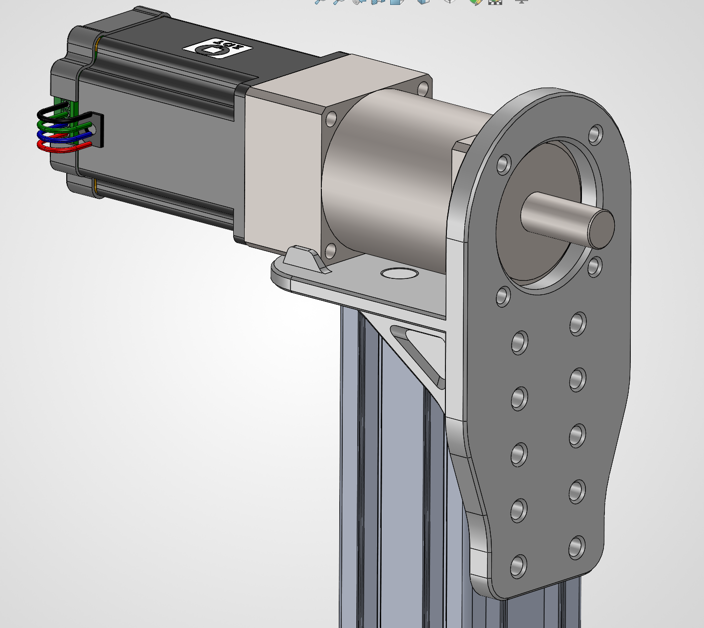
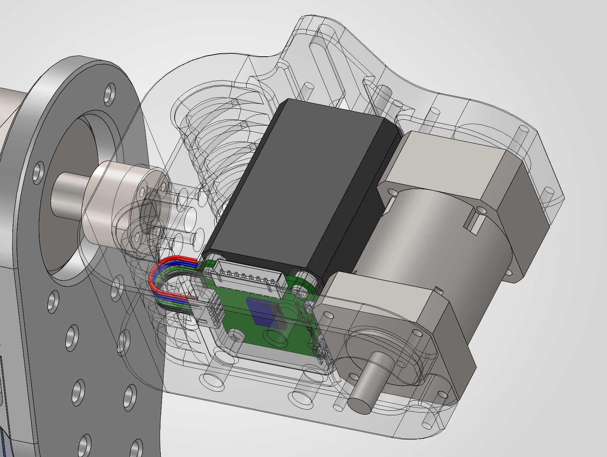
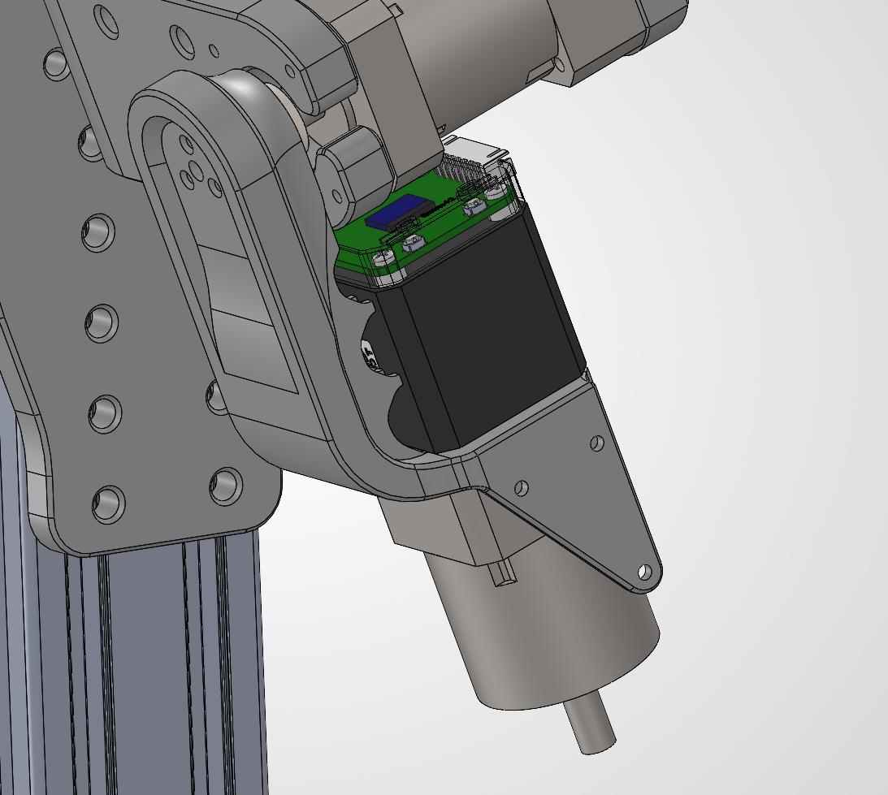
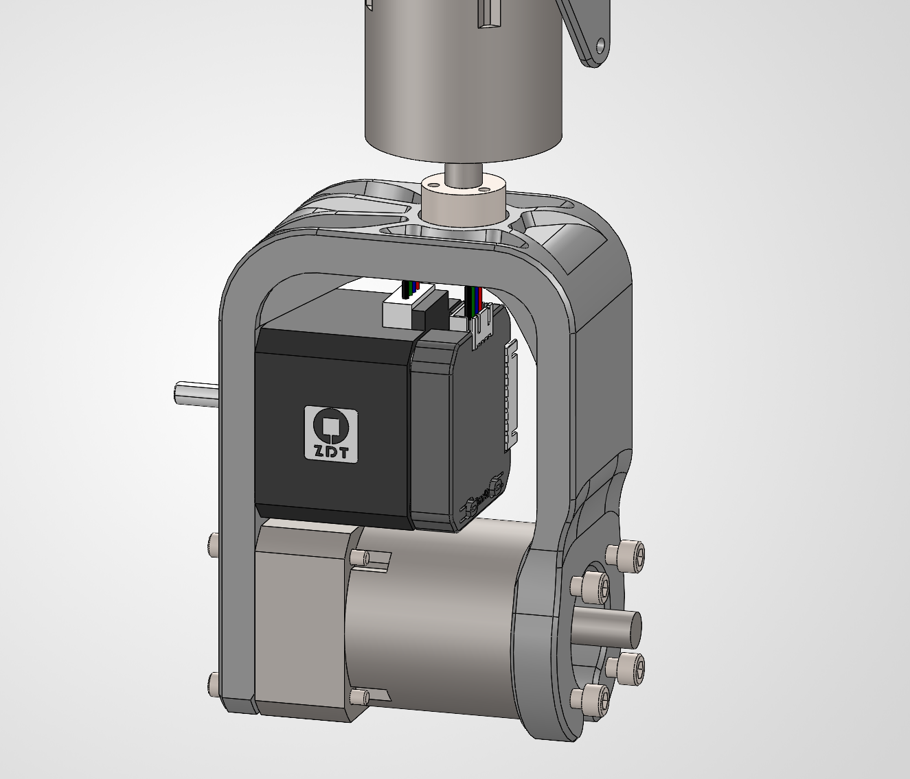
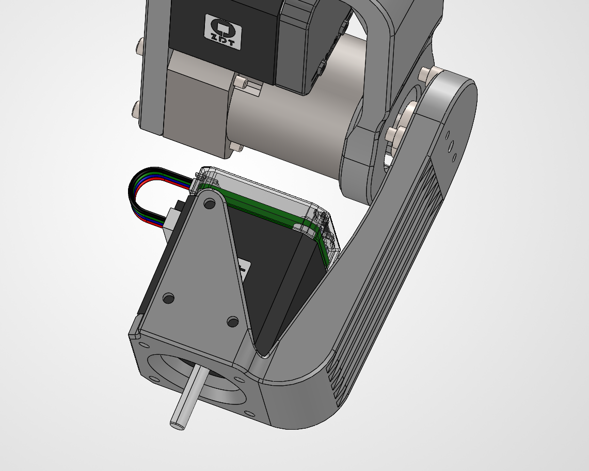
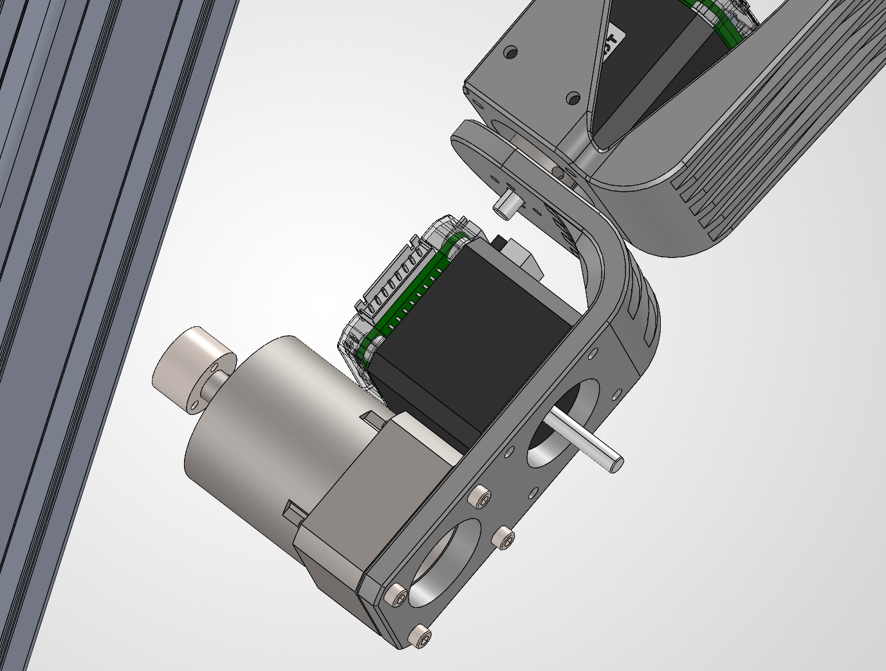

# Assembly Guide - ArmSync 6-DOF Robotic Arm

[中文文档](/Hardware/Assembly%20Guide-zh-CN.md)

## Preparation

### Tool List
- Hex key set / screwdriver set (a power drill or electric screwdriver is recommended)

### Parts Check
Before assembly, check that all parts are present using the [Bill of Materials](./Parts%20BOM-zh-CN.md).

---

## Assembly Steps

### Step 1: J1 Base Rotation Joint

**Parts required:**
- One J1 Base printed part
- One 6060 aluminum extrusion, 650mm
- One 57×76mm stepper motor
- One PRF57-L2-20-P2 gearbox
- Ten M6×16 screws
- Twelve M6 T-nuts
- Eight M5×25 screws

**Assembly procedure:**

1. **Install the aluminum-extrusion base**
   - Connect the 6060 aluminum extrusion to the J1 Base.
   - Secure the extrusion with M6 T-nuts and M6×16 screws.
   - Ensure that the extrusion is perpendicular to the base and tighten the screws evenly. Four 3D-printed pins can be inserted into the top to assist alignment.

2. **Install the gearbox**
   - Align the gearbox output-shaft flange with the circular ring on the structural part, then secure the gearbox to the base with M5 screws.

3. **Install the motor**
   - Align the shaft of the 57 stepper motor with the gearbox input shaft and insert it. Tighten the fastening screws at the gearbox input.
   - Check that the motor shaft and gearbox shaft rotate together.



---

### Step 2: J2 Shoulder Pitch Joint

**Parts required:**
- One Shoulder printed part
- One 42×60mm stepper motor
- One PRF42-L2-30-P2 gearbox
- One Z21 14×26×17 locking bushing (not recommended)
- One single-diaphragm coupling D32d14 L28 (recommended). **Note: The coupling must be separated into two halves for use. One half, using its shaft bore and end flange, is sufficient to connect the structural part to the shaft.**
- Four M3×31 screws (for the locking bushing)
- Eight M3×20+ screws
- Four M3×75+ screws

**Assembly procedure:**

1. **Connect J1 and J2**
   - Align the Shoulder part with the gearbox output shaft of the J1 Base.
   - Connect them using either the locking bushing or coupling. The screws must be tightened very firmly.
   - **Note: This is the primary load-bearing connection for the entire arm. Make sure it is tightened securely.**

2. **Install the gearbox on the shoulder**
   - Insert the PRF42-L2-30-P2 gearbox into the outer position of the structural part as shown below, and secure it with eight M3 screws.

3. **Install the motor**
   - Remove the plastic protective cover from the motor driver board.
   - Slide the 42×60mm motor into the motor position inside the Shoulder.
   - Use a screwdriver through the four prepared holes to remove the original M3 motor screws one by one, replacing them with 75mm-long screws to fasten the motor to the structural part.



---

### Step 3: J3 Shoulder Yaw Joint

**Parts required:**
- One Upperarm up printed part
- One 42×40mm stepper motor
- One PRF42-L1-10-P2 gearbox (round flange)
- One Z21 8×18×11 locking bushing (or the coupling option, using one half of an L32d8 coupling)
- Three M2.5×16 screws (for the locking bushing)
- Four M3×59+ screws

**Assembly procedure:**

1. **Align the motor holes**
   - Align the 42×40mm motor with the motor position in Upperarm up.
   - Remove the original screws and use M3×59+ screws to pre-attach the motor to the structural part.

2. **Install the gearbox and motor**
   - Place the round flange of the PRF42-L1-10-P2 gearbox facing upward and align it with the lower end of Upperarm up.
   - Tighten the M3×59+ screws.

3. **Connect to the shoulder**
   - Align the assembly with the shoulder gearbox output shaft as shown below.
   - Connect it using the locking bushing or coupling, and make sure the screws are tight.



---

### Remaining Joints

The assembly procedures for the remaining joints are similar to those described above. Pay attention to the 42-series motor model and screw lengths. The assembly views for each joint are shown below:

#### J4



#### J5



#### J6



---

### End-Effector Gripper

This gripper is based on the separated gripper version of the MakerWorld model [Parallel gripper for standard Open SO-101 robotic arm](https://makerworld.com/zh/models/1549112-parallel-gripper-for-standard-open-source-so-101-r). Refer to that page for details.

You can also print the [Gripper Adapter](3D%20Files/STEP%20and%20STL/Gripper/Gripper%20Adapter.STEP) to adapt other custom end effectors and support mounting an end-effector camera.

---

### Timing Belt and Pulley Installation

**Parts required:**
- Two 2GT 20-tooth timing pulleys
- Four H3M 25-tooth timing pulleys
- One 128-2GT-6 timing belt
- One H3M 162-H3M-10 timing belt
- One H3M 162-H3M-15 timing belt

**Assembly procedure:**

1. **Install the shaft**
   - Clamp the 5mm metal shaft onto the gearbox input end where the timing belt is to be installed.

2. **Install the pulleys and belt**
   - Pre-assemble each pulley and its corresponding belt, then slide both pulleys onto the motor shaft and gearbox shaft together.
   - Ensure that the pulley teeth remain engaged with the belt teeth.
   - Secure the pulleys to the shafts, keeping them parallel.

**Note: Belt tension must be adjusted by fine-tuning the center distance between the motor and gearbox shafts. Do not over-tension the belt.**

---

## Wiring

### CAN Bus Wiring

All motors are connected in series through the CAN bus:

```
Controller CAN_H → J1 CAN_H → J2 CAN_H → ... → J6 CAN_H
Controller CAN_L → J1 CAN_L → J2 CAN_L → ... → J6 CAN_L
```

**Notes:**
- Add a 120Ω termination resistor at both ends of the CAN bus.
- Twisted-pair wire is recommended.
- Each node address must be configured individually (J1=1, J2=2, ...).

### Power Wiring

- Main power: 24VDC (according to the motor rated voltage)
- Servo power: 5VDC (end effector)
- Make sure the power supply can drive all motors simultaneously.
- Use 14AWG silicone wire to connect all stepper motors in parallel. Pay attention to solder-joint quality and insulation.
