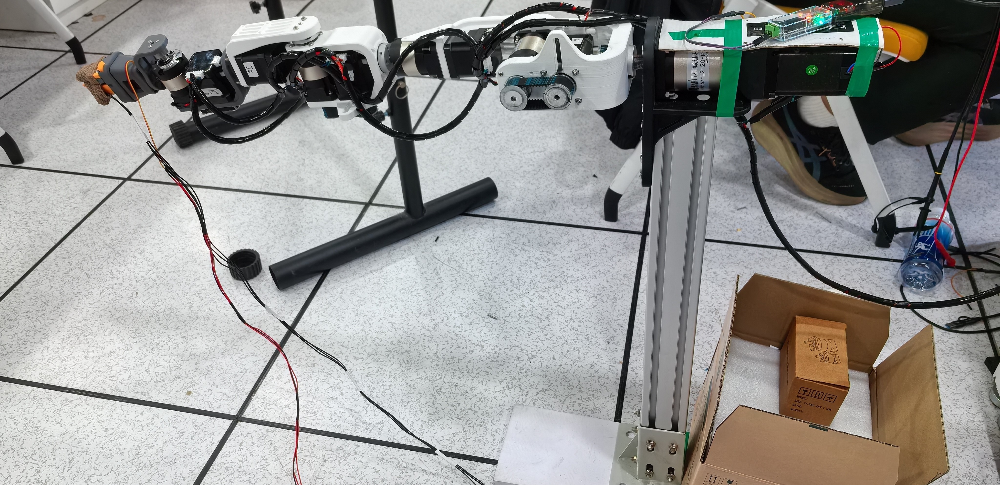
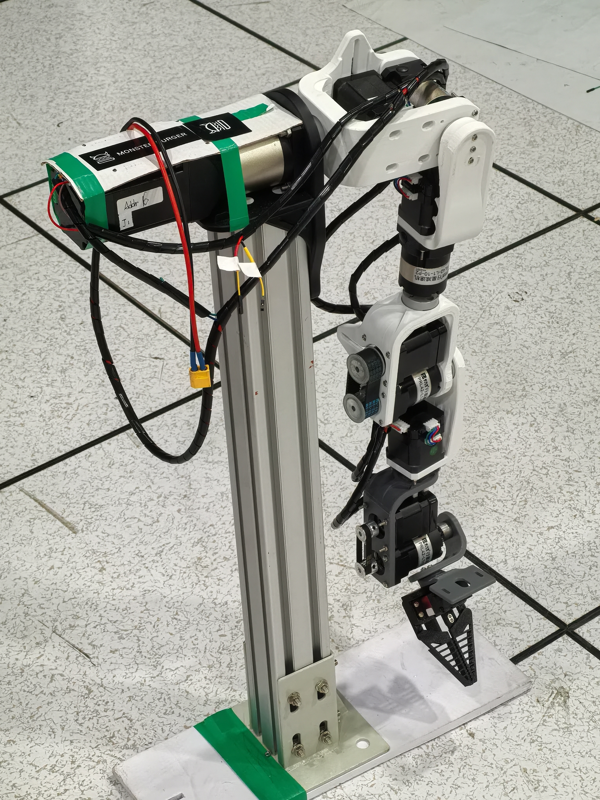

# ArmSync

ArmSync 是一款采用双 IMU 主从无线遥操作方案的六自由度机械臂项目，最初为瑞萨电子设计竞赛开发。

本仓库包含机械结构、PCB、嵌入式固件、运动学工具和 UI 资源。欢迎参考其中的设计与代码

**⚠ 警告：本仓库软件资源仅供参考**

[English Document](README.md)

---

## 项目简介

ArmSync 是一款以 PLA 3D 打印件为主体的六自由度机械臂，包含 J1～J6 六个机械关节，可配置独立的末端执行器。





主要特点：

- **六自由度**：J1 基座旋转、J2 肩部俯仰、J3 肩部偏航、J4 肘部、J5 腕部俯仰、J6 腕部旋转
- **双 IMU 主从控制**：通过用户端 IMU 模块获取上臂和前臂姿态，并进行无线/串口主从控制
- **步进电机执行器**：J1～J6 使用带减速器的步进电机和控制器
- **可配置末端执行器**：3D资源中提供夹爪，也可以安装其他自定义末端执行器

## 主要参数

| 参数 | 数值 |
|------|------|
| 机械臂自由度 | 6（J1～J6） |
| 臂展（含夹爪） | 约 610mm |
| 末端目标负载 | 350g |
| 控制接口 | CAN 总线 / 舵机信号 |
| 电源 | 24VDC（步进电机）/ 5VDC（舵机） |
| 结构材料 | PLA 3D 打印件 |

## 仓库结构

```
ArmSync/
├── Hardware/                         # 机械结构、电气和装配资料
│   ├── 3D Files/                     # 机械臂、夹爪和控制器 3D 模型
│   │   ├── 3MF for printing/         # 可直接用于切片的 3MF 文件
│   │   ├── SolidWorks 2026/          # SolidWorks 源文件
│   │   ├── STEP and STL/             # STEP/STL 通用格式
│   │   └── URDF/                     # ROS/Gazebo 模型
│   ├── PCBs/                         # PCB 工程和图片
│   ├── example_imgs/                 # J1～J6、EE 装配示意图
│   ├── Parts BOM-zh-CN.md            # 中文物料清单
│   ├── Assembly Guide-zh-CN.md       # 中文装配指南
│   └── readme-zh-CN.md               # 硬件文档
├── Software/                         # 固件、运动学工具和 UI 资源
│   ├── Arm-Side/                     # RA8P1 机械臂端主控工程
│   │   ├── Solution/                 # e² studio Solution、CPU0、CPU1 工程
│   │   ├── arm_ik_test.py            # Jetson 输入的 IK 可视化工具
│   │   ├── arm_angle_view.py         # 关节角度和空间向量可视化工具
│   │   └── Scripts README-zh-CN.md   # Python 工具使用说明
│   ├── User-Side/                    # RA4M1 用户端控制器和 IMU 工程
│   ├── Deprecated Project Folders/   # 已废弃的旧工程
│   ├── UI/                           # HMI、界面布局和字体资源
│   └── readme-zh-CN.md               # 软件文档
├── Helpful Docs/                     # 芯片、NPU、HMI 和双核开发参考资料
├── LICENSE                           
├── README-zh-CN.md                   
└── README.md                         
```

## 快速开始

### 硬件

- [硬件文档](Hardware/readme-zh-CN.md)：硬件规格、目录结构和资源说明
- [物料清单](Hardware/Parts%20BOM-zh-CN.md)：电机、减速器、紧固件和开发工具
- [装配指南](Hardware/Assembly%20Guide-zh-CN.md)：机械臂装配、夹爪、同步带和接线
- [3D 文件](Hardware/3D%20Files/)：SolidWorks、STEP/STL、3MF 和 URDF 文件
- [PCB 资料](Hardware/PCBs/)：控制器、IMU 和 RA8P1 扩展板相关资料

打印机械结构时，可以使用：

`Hardware/3D Files/3MF for printing/Renesas ArmSync.3mf`

也可以根据需要使用 `STEP and STL/` 中的通用模型，或在 `SolidWorks 2026/` 中修改源文件。

### 软件

阅读 [软件文档](Software/readme-zh-CN.md)，确认当前工程结构和工具链：

- RA8P1 主控使用 e² studio，并由 Solution、CPU0 和 CPU1 三个工程共同组成
- RA4M1 控制器和 IMU 使用 CMake、Ninja 和 VS Code
- 机械臂端 Python 工具使用说明见 [Scripts README-zh-CN.md](Software/Arm-Side/Scripts%20README-zh-CN.md)
- 机械臂坐标系和运动学参数见 [Armsync_IK_Model.md](Software/Arm-Side/Armsync_IK_Model.md)

请确认 FSP、Arm GCC 工具链、串口配置和实际硬件版本相匹配。
